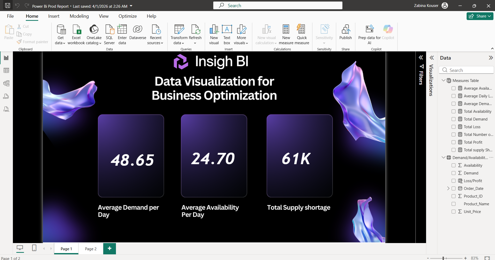

# supply-chain-analysis-powerbi
Power BI project analyzing demand vs availability and supply shortages
# Supply Chain Demand vs Availability Analysis

## Objective

Analyze the gap between product demand and availability to identify supply shortages, revenue loss, and optimization opportunities.

## Problem Statement

In many supply chain systems, demand does not align with product availability. This leads to lost sales, increased operational inefficiencies, and reduced profitability. This project focuses on identifying these gaps and quantifying their impact.

## Dataset

* Product-level demand and availability data
* Daily transactional records
* Includes pricing and order details

## Tools Used

* Power BI (Dashboard & Visualization)
* SQL (Data Analysis)
* Excel / CSV (Data Source)

## Key Metrics

* Average Demand per Day
* Average Availability per Day
* Total Supply Shortage
* Total Profit
* Total Loss
* Average Daily Loss

## Key Insights

* Demand consistently exceeds availability, causing frequent shortages
* High losses are driven by unmet demand
* A small set of products contributes disproportionately to total loss

## Business Recommendations

* Increase inventory for high-demand products
* Improve demand forecasting using historical trends
* Reduce excess stock for low-demand items

## Dashboard Preview

## Dashboard Preview

## How to Use

1. Download the `.pbix` file from the dashboard folder
2. Open using Power BI Desktop
3. Explore filters and metrics

## Project Outcome
This analysis highlights critical supply-demand mismatches and provides actionable insights to reduce losses and improve supply chain efficiency.
